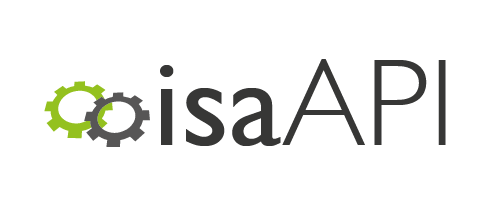

# isatab-create: ISA Create tool for Metabolomics
Version: 0.9.3

## Short Description

A container the `isatools.create.models` module of the [ISA-API](http://github.com/ISA-tools/isa-api)

## Description

The ISA-API is a Python 3 library that can create, manipulate, and convert ISA-formatted content. In the `isatools.create.models` module there is functionality to create ISA-Tab data from experimental design objects. This is wrapped up as the `container-isatab-create` container.

## Key features

- Create ISA-Tab metadata from experimental design parameters.

## Functionality

- Other Tools

## Tool Authors

- [ISA Team](http://isa-tools.org)

## Container Contributors

- [David Johnson](https://github.com/djcomlab) (University of Oxford)

## Website

- https://github.com/ISA-tools/isa-api


## Git Repository

- https://github.com/phnmnl/container-isatab-create.git

## Installation

For local individual installation:

```bash
docker pull docker-registry.phenomenal-h2020.eu/phnmnl/isatab-create
```

## Usage Instructions

### For direct docker usage

Basic usage:
```bash
docker run docker-registry.phenomenal-h2020.eu/phnmnl/isatab-create --parameters_file <galaxy_json_parameters>
```

## Publications

- Haug, K., Salek, R. M., Conesa, P., Hastings, J., de Matos, P., Rijnbeek, M., ... & Maguire, E. (2012). MetaboLights - an open-access general-purpose repository for metabolomics studies and associated meta-data. Nucleic acids research, gks1004.
- Sansone, Susanna-Assunta, Rocca-Serra, Philippe, Gonzalez-Beltran, Alejandra, Johnson, David, &amp; ISA Community. (2016, October 28). ISA Model and Serialization Specifications 1.0. Zenodo. http://doi.org/10.5281/zenodo.163640
- Sansone, Susanna-Assunta, et al. (2012, January 27). Towards interoperable bioscience data. Nature Genetics 44, 121–126. http://doi.org/10.1038/ng.1054
